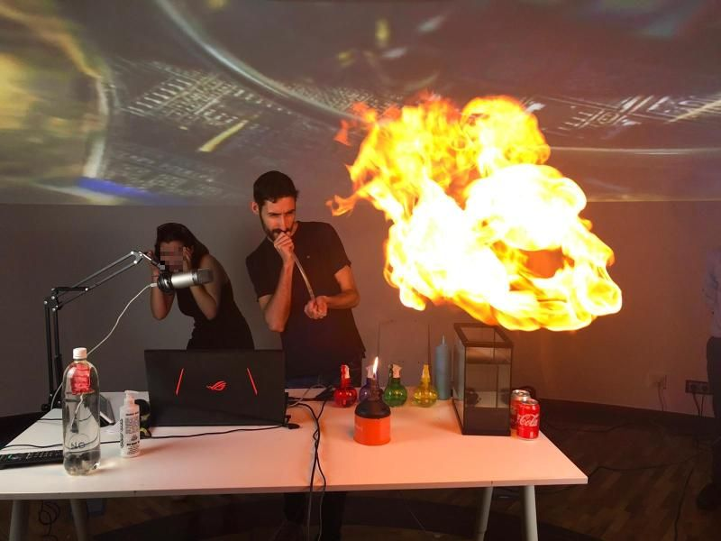

<h1 align="center">
    
     
    
     
    
</h1>

## 🖨️ 3D Design

| Tags | Site | Explanation |
| --- | --- | --- |
| 🆒 | [Tinkercad](https://www.tinkercad.com) | 3D Design made easy |

## 🧠 Artificial Intelligence

| Tags | Site | Explanation |
| --- | --- | --- |
| 🆒 | [Dialogflow](https://dialogflow.cloud.google.com/) | Voice Assistant made easy |
| 🆒🆕 | [Quick Draw](https://quickdraw.withgoogle.com) | Play Pictionary against Google |
| 🆒 | [TeachableMachine](https://teachablemachine.withgoogle.com/) | Fast and friendly IA (Image, Sound, Pose Recon)

## 👾 Curious Games

| Tags | Site | Explanation |
| --- | --- | --- |
| 🆒🆕 | [Mario Bros. as a Goomba](http://www.byronknoll.com/goomba.html) | Play Super Mario Bros. from the perspective of a Goomba |
| 🆒🆕 | [CandyBox 2](https://candybox2.github.io/) | ASCII awesome game (also "How to modify game saved data) |
| 🆒 | [Code](https://code.org/) | Coding games to learn programming |
| 🆒 | [CodeCombat](https://codecombat.com/) | Coding games to learn programming |

## 👤 Hacking!

| Tags | Site | Explanation |
| --- | --- | --- |
| 🆒 | [DeHashed](https://www.dehashed.com/) | Check if your accounts have been pwned (See the password leak with Premium account) |
| 🆒 | [HaveIBeenPwned](https://haveibeenpwned.com/) | Check if your accounts have been pwned |
| 🆒 | [The Wayback Machine](https://archive.org/web/) | Explore what the pages looked like in the past |

## 👀 Internet Curiousities

| Tags | Site | Explanation |
| --- | --- | --- |
| 🆒🆕 | [Every Second](https://everysecond.io/) | Check what's happening every second |
| 🆒🆕 | [lmgtfy](https://es.lmgtfy.com/) | Explains with an animation how to search the Internet |
| 🆒 | [Spurius Correlations](https://www.tylervigen.com/spurious-correlations) | Curious, strange and meaningless correlations |
| 🆒 | [The Wayback Machine](https://archive.org/web/) | Explore what the pages looked like in the past |
| 🆒🆕 | [World's Highest Website](https://worlds-highest-website.com/) | The World’s Highest Website! It’s 18.94 kilometers high |

## 💻 Programming

| Tags | Site | Explanation |
| --- | --- | --- |
| 🆒 | [AppInventor2](https://appinventor.mit.edu/) | Android Apps made easy |
| 🆒 | [Bitsbox](https://bitsbox.com/hoc2016.html) | Simulate how to create apps with code |
| 🆒 | [Calliope](https://makecode.calliope.cc/) | Just Micro:bit improved |
| 🆒🆕 | [CelloCAD](http://cellocad.org/) | Program real bacterias as an electrical circuit! |
| 🆒 | [Code](https://code.org/) | Coding games to learn programming |
| 🆒 | [CodeCombat](https://codecombat.com/) | Coding games to learn programming |
| 🆒 | [Dialogflow](https://dialogflow.cloud.google.com/) | Voice Assistant made easy |
| 🆒 | [Micro:bit](https://makecode.microbit.org/) | Arduino for kids |
| 🆒 | [Playground](https://makecode.adafruit.com/) | Just Callipe improved |
| 🐱 | [Scratch](https://scratch.mit.edu/) | Argh. Just... Scratch. |

## 🐿️ Weirdest Internet

| Tags | Site | Explanation |
| --- | --- | --- |
| 🆒🆕 | [11111111111111111...](http://111111111111111111111111111111111111111111111111111111111111.com) | Arnold Sailormoonegger |
| 🆒🆕 | [Cyclical Website](https://orteil.dashnet.org/nested) | An infinite web page |
| 🐎 | [Endless Horse](http://endless.horse/) | Just and endless horse |
| 🆒🆕 | [Infinite Zoom](https://infinitezoom.net/) | Infinite zoom using geometric and fractal patterns | 

---

## Credits

This is just a list of cool stuff I find and teach in my outreach talks. If you know any cool Internet site or are interested in the things I do, don't hesitate to contact me.
